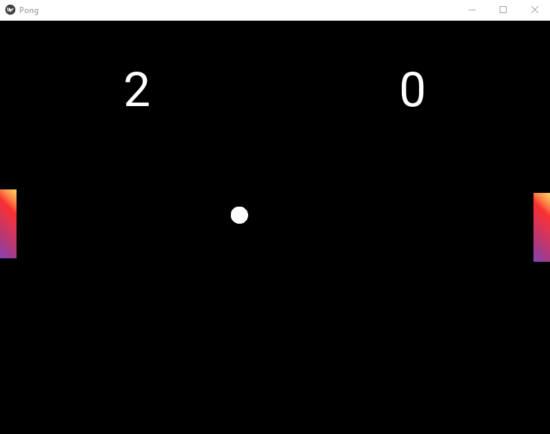

# Ping-pong-game

For my last project at GA I decided to learn python and specifically and library. I decided on building the classic ping pong game using a library Called Kivy. 

## Installation

- Clone/Fork
- Setup your python enviroment
- import necessary packages
- run the game!

## Contributing

1. Fork it!
2. Create your feature branch: `git checkout -b my-new-feature`
3. Commit your changes: `git commit -am 'Add some feature'`
4. Push to the branch: `git push origin my-new-feature`
5. Submit a pull request :D

## Built with
[Kivy](https://kivy.org/#home)  
[Python](https://www.python.org/)  
[PyCharm](https://www.jetbrains.com/help/pycharm/2021.2/quick-start-guide.html)

 

## License

